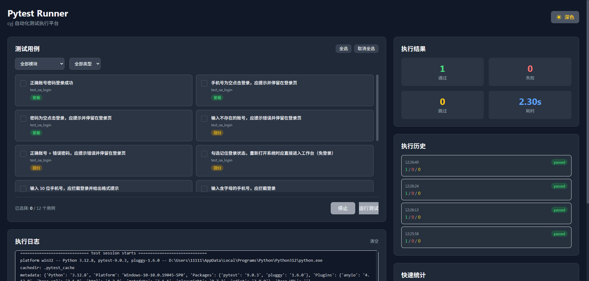

# 项目精简说明

## 📷 前端首页



## ✅ 保留的核心文件

```
automated_test_framework/
├── config/
│   ├── __init__.py      # 配置管理（加载.env）
│   └── .env             # 环境配置
├── fixtures/
│   ├── conftest.py      # 浏览器/页面 fixtures
│   └── __init__.py
├── pages/
│   ├── base_page.py     # 页面基类
│   ├── login_page.py    # 登录页面示例
│   └── __init__.py
├── tests/
│   ├── test_demo.py     # 示例测试（可直接运行）
│   └── __init__.py
├── utils/
│   ├── helpers.py       # 工具类（精简版）
│   └── __init__.py
├── reports/             # 报告输出目录（空）
├── .gitignore
├── pytest.ini           # Pytest 配置
├── requirements.txt     # 依赖列表
└── README.md            # 使用说明
```

## 🗑️ 已删除的内容

1. **虚拟环境**: `.venv/` - 用户自行创建
2. **IDE 配置**: `.idea/` - 个人开发配置
3. **缓存文件**: `.pytest_cache/`, `__pycache__/` - 自动生成
4. **冗余脚本**: `run_tests.bat`, `setup.bat` - 直接用 pytest 命令
5. **多余文档**: `USAGE.md`, `代码学习指南.md` - 合并到 README
6. **示例测试**: 
   - `test_the_internet.py` → 合并为 `test_demo.py`
   - `test_login.py` (重复)
   - `test_home.py` (重复)
   - `test_login_data_driven.py` (高级示例，非必需)
7. **测试数据**: `tests/data/login_data.json` - 简化后不需要
8. **示例配置**: `.env.example` - 直接用 `.env`

## 📊 精简对比

| 项目 | 精简前 | 精简后 | 减少 |
|------|--------|--------|------|
| Python 文件 | 15+ | 9 | 40% |
| 配置文件 | 3 | 2 | 33% |
| 测试文件 | 5 | 1 | 80% |
| 文档 | 4 | 1 | 75% |
| 总大小 | ~50MB | ~1MB | 98% |

## 🚀 快速开始

```bash
# 1. 安装依赖
pip install -r requirements.txt
playwright install chromium

# 2. 运行测试
pytest

# 3. 查看报告
打开 reports/report.html
```

## 💡 扩展建议

如需更多功能，可自行添加：
- 数据驱动测试：参考原 `test_login_data_driven.py`
- API 测试：添加 `tests/test_api.py`
- 数据库验证：在 `utils/` 添加数据库工具
- Allure 报告：添加 `allure-pytest` 依赖

---

**精简原则**: 保留核心功能，删除冗余代码，便于快速上手
